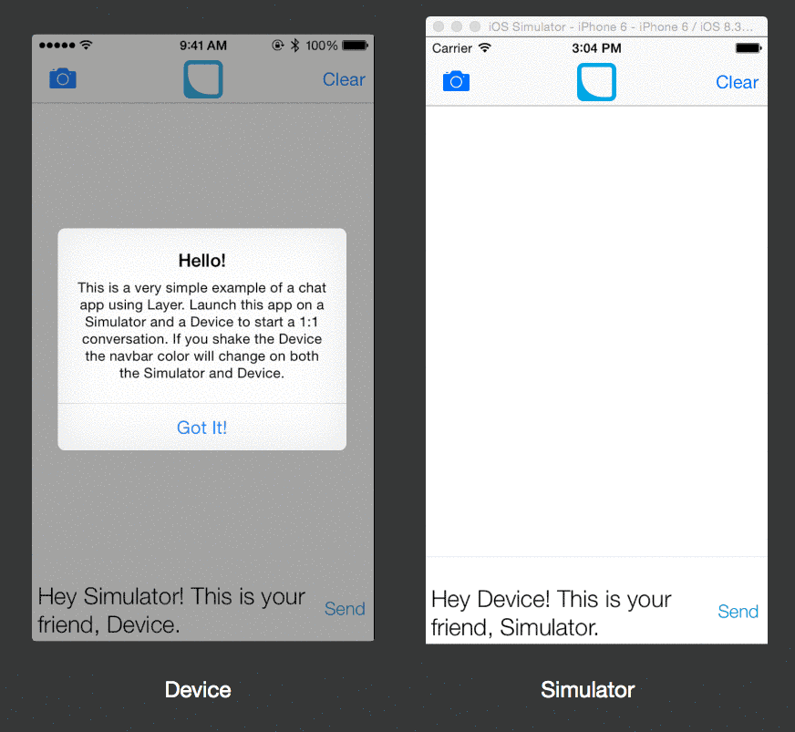

# Layer Quick Start for iOS

**Example code for integrating [LayerKit](https://layer.com/).**

Quick Start is a sample application highlighting how to integrate LayerKit, the iOS SDK for the Layer communications platform. It presents a very simple example of a chat app using Layer.

## Requirements

The Quick Start application requires Xcode and the iOS SDK v8.0. Dependencies are managed via [CocoaPods](http://cocoapods.org/) to simplify installation.

## Usage

1. Clone the project from Github: `$ git clone https://github.com/layerhq/quick-start-ios.git`
2. Install the dependencies via CocoaPods: `$ pod install`
3. Open `QuickStart.xcworkspace` in Xcode.
4. Replace LAYER_APP_ID in LQSAppDelegate.m (line 16) with your App ID from the developer dashboard (http://developer.layer.com) under the "Keys" section.  If you skip this step you will get an error on app launch.
5. Build and run the Quick Start application on a Simulator and a physical Device to start a 1:1 conversation between them.

NOTE: If you shake the Device the navbar color will change on both the Simulator and Device.

## Highlights

* Demonstrates how to implement authentication, query controller, typing indicators and metadata
* Provides a reference implementation for driving Message UI's via an `LYRQueryController`

## Configuration

In order to populate the sample app with content, you must configure the following variable inside Constants.h:

* `LAYER_APP_ID`: The Layer application identifier for you application.

The authentication process requires that you provide a sandbox app identifier that has been configured to use the Layer Identity Provider.

## Credits

QuickStart was lovingly crafted in San Francisco by Abir Majumdar during his work on [Layer](http://layer.com). At Layer, we are building the Communications Layer for the Internet. We value, support, and create works of Open Source engineering excellence.

Abir Majumdar

- http://github.com/maju6406
- http://twitter.com/beersy
- abir@layer.com

## License

QuickStart is available under the Apache 2 License. See the LICENSE file for more info.
